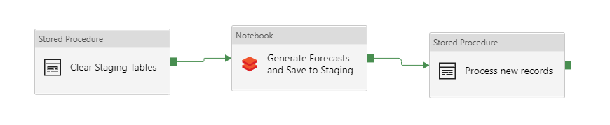
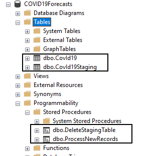
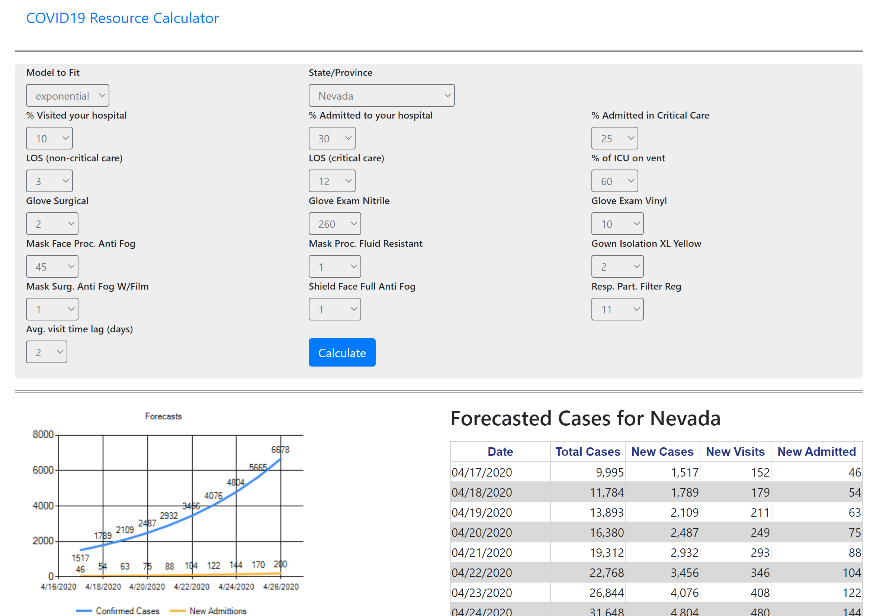
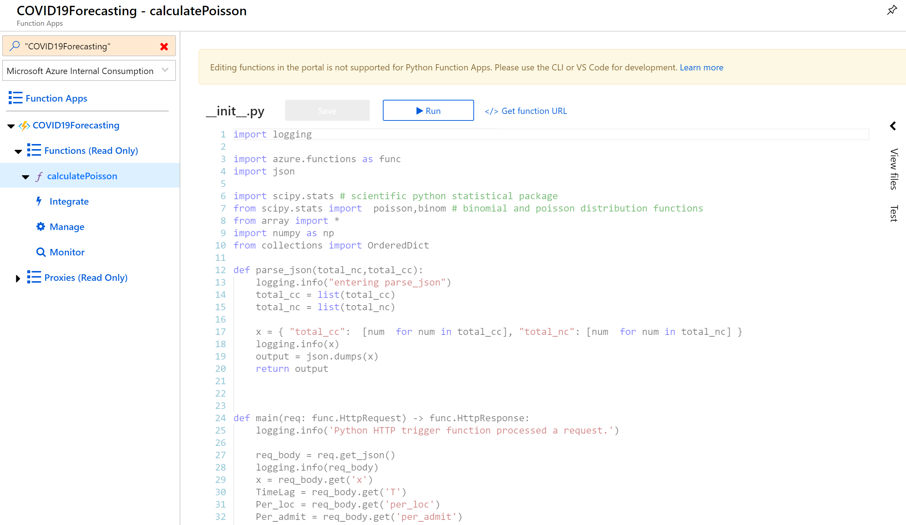

# COVID19 PEE Forecasting Calculator | Azure Serverless Architecture

This project was born from <a href="https://webalyticos.home.blog/2020/03/24/covd19forecast/" target="_blank"> Rush's Medical Center </a> development of the same project using a Junyper Notebook & hosting it on a virtual machine using Voila.

Rush's Medical Center calculates forecasting based on 3 models: 
* Exponential
* Logistics
* Polynomial

### [Deploy to Azure](deploy/deploy.md)

## Architecture

## Component Description

* Azure Data Factory
* Serverless Single SQL Database
* Azure Databricks
* Web App
* Azure Functions

### Azure Data Factory
It was implemented to orchestrate the ingestion and processing of daily COVID-19 confirmend cases data collected and provided by [John Hopkins University](https://raw.githubusercontent.com/CSSEGISandData/COVID-19/master/csse_covid_19_data/csse_covid_19_daily_reports/)

The pipeline clears the staging table that holds data to be processed, calls an Azure Databricks that reads data from John Hopkins, parses daily information per estate and then generates the forecasting calculations, saves them to SQL server, then a stored proceduce is called to calculate new cases and save the fresh data into the COVID19Forecast Table.

The pipeline is scheduled to run every day at 5:00 am

### Azure SQL Single Database - Serverless pricing schema

Serverless SQL databases charges you for the storage space used by your database and the compute time only, making it a very affordable option. The database contains to tables: COVID19 and CoVID19Staging. There are 2 stored procedures: DeleteStagingTable (self explanatory)  and ProcessNewRecords, this stored procedure truncates the COVID19 table, inserts the new records and calculates new cases.

Separation between the two tables is due to indexing on COVID19 for faster searches.

### Azure Databricks

Azure data bricks has 2 notebooks:

get_dataframe_dailyreports: this notebook aggreates data from [John Hopkins University](https://raw.githubusercontent.com/CSSEGISandData/COVID-19/master/csse_covid_19_data/csse_covid_19_daily_reports/) and creates a temporary file

build forecast reads the temporary file and calculates forcasting values for every estate for 3 models:

* Exponential
* Logistic
* Polynomial

### Web App

This is a front end application for end users. This is a C# - ASP .NET application.

### Azure Functions

This is a phython based function that runs statisticals calculations to calculate PPE forcasting for the selected state based on the selected parameters

