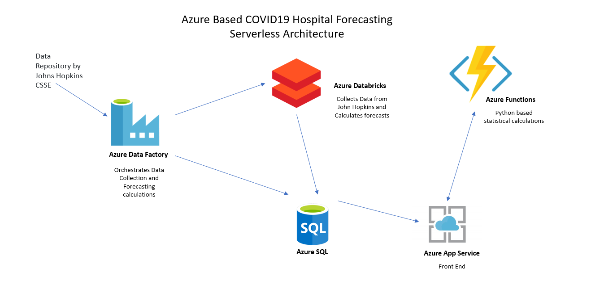

# COVID19 PEE Forecasting Calculator | Azure Serverless Architecture

This project was born from <a href="https://webalyticos.home.blog/2020/03/24/covd19forecast/" target="_blank"> Rush's Medical Center </a> development of the same project using a Junyper Notebook & hosting it on a virtual machine using Voila.

Rush's Medical Center calculates forecasting based on 3 models:

* Exponential
* Logistics
* Polynomial

## Problems to Address

* The solution architecture is not scalable, it was deployed using Azure VM Scale Sets
* Junyper Notebooks are great to develop and test models but not to release them to production, every time a request was made to the application, the entire notebook is executed
* Expected user experience was clunky

### [Deploy to Azure](deploy/deploy.md) 

## Architecture

## Advantages of Serverless Architecture

* Scalable – autoscaling can handle increased load.
* Microservices Design – Independent modules that communicate with each other using well-defined API contracts. These service modules are highly decoupled building blocks that are small enough to implement a single functionality.
* Affordable – starting around ~$200 a month

## Architecture Components

* App Service
* Azure Functions
* Azure Data Factory
* Serverless Single SQL Database
* Azure Databricks

### Web App

* This is the front-end application for users. This is a C# - ASP .NET application, using out of the box components
* Windows based App service
* Scalable
* Integrated with Application Insights

### Azure Functions

* Python-based function that runs statistical calculations for PPE forecasting based on user selected parameters in the Front-End application
* Linux Based App Service – Premium Service Pricing model
* Scalable
* Integrated with Application Insights

### Azure Data Factory

* Orchestrates the ingestion and processing of daily COVID-19 confirmed cases data collected and provided by [John Hopkins University](https://raw.githubusercontent.com/CSSEGISandData/COVID-19/master/csse_covid_19_data/csse_covid_19_daily_reports/)
* The pipeline clears the staging table that holds data to be processed, calls an Azure Databricks that reads data from John Hopkins, parses daily information per estate and then generates the forecasting calculations, saves them to SQL server, then a stored procedure is called to calculate new cases and save the fresh data into the COVID19Forecast Table.
* Triggers scheduled to run every day at 5:00 am run the pipeline automatically

### Azure SQL Single Database - Serverless pricing schema

* Serverless SQL databases charges you for the storage space used by your database and the compute time only, making it a very affordable option.
* The database contains to tables: COVID19 and CoVID19Staging. 
* There are 2 stored procedures: DeleteStagingTable (self explanatory) and ProcessNewRecords, this stored procedure truncates the COVID19 table, inserts the new records and calculates new cases.
* Separation between the two tables is due to indexing on COVID19 for faster searches.

### Azure Databricks

This workspace contains two python-based notebooks:

* get_dataframe_dailyreports: this notebook aggregates data from John Hopkins University and creates a temporary file to be used for forecasting

* build forecast reads the temporary file and calculates forecasting values for every US state for 3 models:
   * Exponential
   * Logistic
   * Polynomial
   
 For more information on calculation methodology, please check the documentation provided by <a href="https://webalyticos.home.blog/2020/03/24/covd19forecast/" target="_blank"> Rush's Medical Center </a> 
