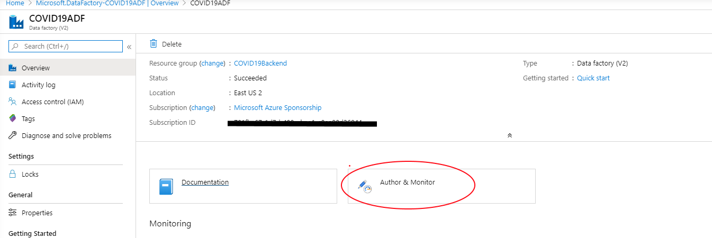
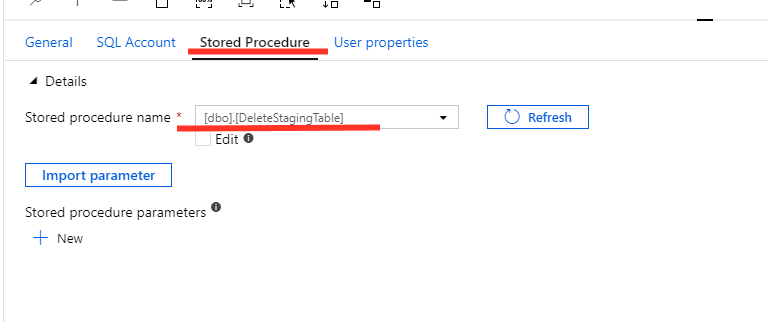
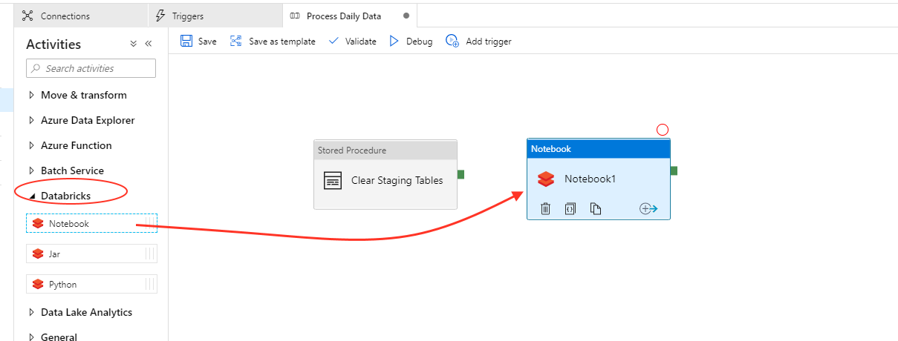

# Build copy pipeline using Azure Data Factory

## Pre-requisite task: [Create Azure Data Factory V2](provision-azure-data-factory-v2.md)

## Task: Create Linked Services Connections

In this section you will create a linked service to the SQL database and to your Azure DataBricks Notebook to process data and calculate forecasts daily.

1. Open the **Azure Data Factory** portal and click the **Author option *(pencil icon)*** on the left-hand side panel. Under **Connections** tab, click **Linked Services** and then click **+ New** to create a new linked service connection.

    

1. On the **New Linked Service** blade, type “Azure Sql” in the search box to find the **Azure SQL** linked service. Click **Continue**.
    
    

1.	On the New Linked Service (Azure SQL Database) blade, enter the following details:
     - **Name**: COVID19SQL
     - **Connect via integration runtime**: AutoResolveIntegrationRuntime
     - **Account selection method**: From Azure subscription
     - **Azure subscription**: *your subscription*
     - **Server Name**: *your server name*
     - **Database Name**: COVID19Forecasts
     - **Authentication** Type: SQL Authentication
     - **User** Name: *your user name*
     - **Password**: *your password*

    

1.	Click **Test connection** to make sure you entered the correct connection details and then click **Finish**

1. On the **New Linked Service** blade, Select the Compute Option, find the **Azure DataBricks** linked service. Click **Continue**.

    

1. On the New Linked Service (Azure DataBricks) blade, enter the following details:
     - **Name**: COVID19Databricks_ADFLink
     - **Connect via integration runtime**: AutoResolveIntegrationRuntime
     - **Account selection method**: From Azure subscription
     - **Azure subscription**: *your subscription*
     - **DataBricks Workspace**: *COVID19DataBricks*
     - **Access Token**: *Access Token Generated on the Notebook Copied to Notepad*
     - **Select Cluster** Existing Interactive Cluster 
     - **Choose from existing clusters**: *COVID19-clusters*    

 

 1.	Click **Test connection** to make sure you entered the correct connection details and then click **Finish**

1. You should now see 2 linked services connections that will be used in our new pipeline

    
  

## Task Create the initial Pipeline

In this section you create a data factory pipeline to copy data in the following sequence:

    * Execute a stored procedure in the SQL database to delete the COVID19Staging Table
    * Execute the DataBricks Notebook that calculates Forecasting
    * Execute a stored procedure in the SQL database to copy records to the COVID19 table and calculate new daily cases.

1. On the New Pipeline tab, enter the following details:

     - **General > Name**: Process Daily Data
    
1. Leave remaining fields with default values.

    
    

1.	From the Activities panel, type “Stored Procedure” in the search box. Drag the *Stored Procedure* on to the design surface. This stored procedure will delete the COVIDStating Table in the SQL Database

  

1. Select the Stored Procedure activity and enter the following details:
     - **General > Name**: Clear Staging Tables
     - **SQL Account > Linked Service**: COVID19SQL
     - **Stored Procedure > Stored procedure name**: DeleteStagingTable
   
1.	Leave remaining fields with default values.

    
    
    

1.	From the Activities panel, type “Stored Procedure” in the search box. Drag the *Stored Procedure* on to the design surface. This stored procedure will delete the COVIDStating Table in the SQL Database

1.	From the Activities panel, type “Notebook” in the search box. Drag the Notebook activity on to the design surface.
    

1.	Select the Notebook activity and enter the following details:
     - **General > Name**: Forecasting Models
     - **Azure Databricks > Databricks linked service**: COVID19Databricks_ADFLink
     - **Settings > Notebook path**: Click on the Browse button and follow the instructions to select the **build forecast** notebook
    
1.	Leave remaining fields with default values.
    
    
    
    

    1.	From the Activities panel, type “Stored Procedure” in the search box. Drag the *Stored Procedure* on to the design surface. This stored procedure will delete the COVIDStating Table in the SQL Database

  

1. Select the Stored Procedure activity and enter the following details:
     - **General > Name**: Process New Records
     - **SQL Account > Linked Service**: COVID19SQL
     - **Stored Procedure > Stored procedure name**: ProcessNewRecords

1.	Leave remaining fields with default values.

    
     
    

1.	Create a **Success *(green)*** precedence constraint between Clear Stating Table to  Forecasting Models to Process New records. You can do it by dragging the green connector from Clear Staging Table and landing the arrow onto Forecasting Models.    

    

## Task Triggers & Publish Pipeline

We are going to create a trigger that will run every 12 hours at 5:00 AM and 5:00 pm to refresh data.

1. Navigate to the top menu blade on the pipeline and **click** on **Add Trigger** then select the **New/Edit** Option

    

1. At the New Trigger blade enter the following parameters:
     - **Name**: Update Daily Data
     - **Type**: Schedule
     - **Start Date**: Select the closest 5:00 AM or PM closest to you
     - **Recurrence**: Every 12 Hours

Click the **Ok** button

  

2.	Publish your pipeline changes by clicking the **Publish** button and follow the instructions

    

3. Once publishing is completed, run the trigger manually to populate the database. Nagivate to the **Trigger** menu option on the top blade of the pipeline, select trigger now, click the OK button

    
    

4. Navigate to the monitor option to check execution of the pipeline
    

5. You will see the results of the inital execution

    

## Next task: [Provision Azure Function](../azure-function/create-azure-function.md)
