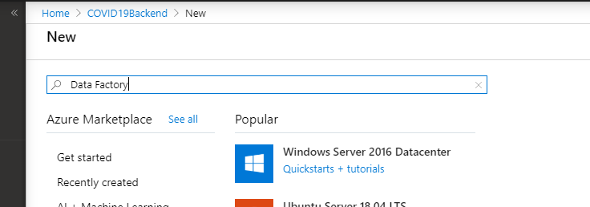
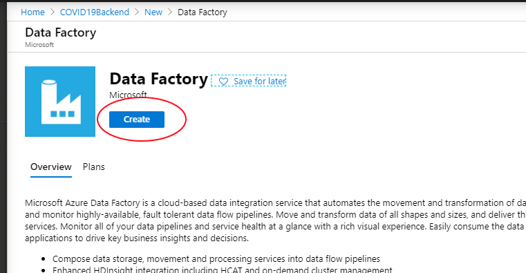
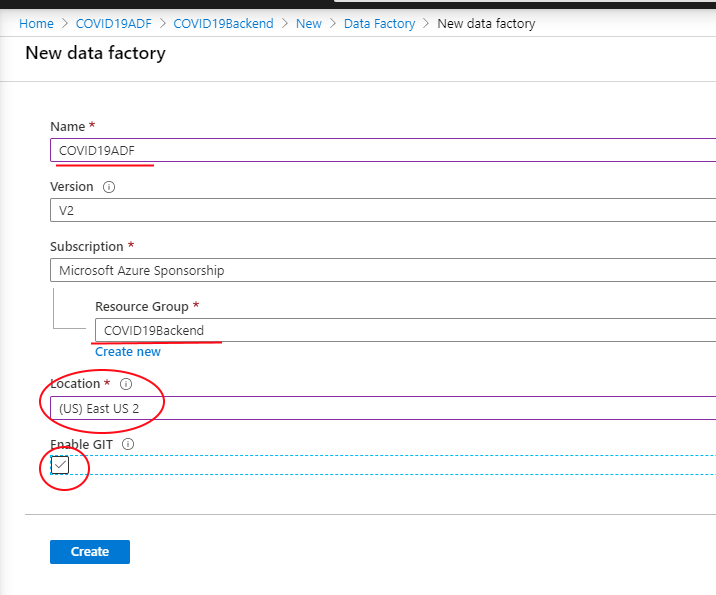
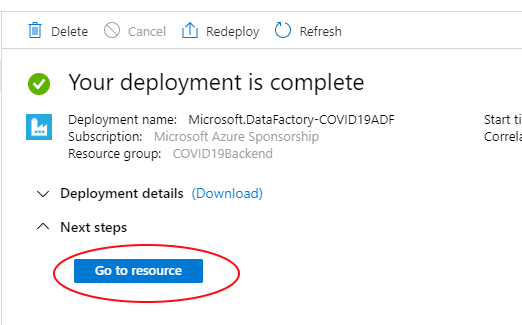

# Provision Azure Data Factory V2

## Pre-requisite tasks:

- [Create Azure Resource Group](../azure-resource-group/create-resource-group.md)
- [Create Azure Databricks](../azure-databricks/create-azure-databricks.md)
- [Create Azure SQL](../azure-sql/create-azure-sql.md)

## Task: Create Azure Data Factory V2

1. In Azure Portal, click **+Create a resource** link at top left of the page

1. In the Azure Marketplace search bar, type **data factory** and click on **Data Factory** that appears in the drop down list

    

1. Click the **Create** button.
    
    

1. Enter the following and click **Create**:
    * Name: COVID19ADF
    * Resource Group: COVID19Backend
    * Version: *V2*
    * Location: *Select your preferred location*
    * Skip Git integration for now

        

1. Check the **Notifications** icon in the upper right and wait until you see **Deployment succeeded** then click the **Go to resource** button.

    

1. Click on **Author & Monitor** to navigate to the Azure Data Factory web workspace. This is where ADF development will take place.

    

## Next task: [Build the Pipeline](create-adf-pipeline.md)

