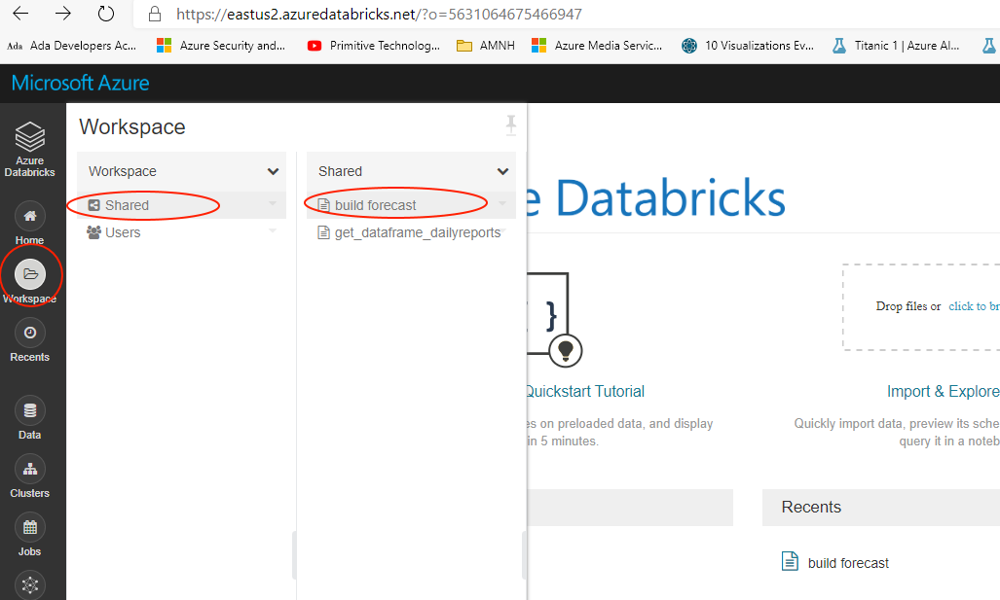

# Configure Notebook

## Pre-requisite task: [Import Notebook](import-notebook.md)

## Task: Configure notebook

1. In the Databricks navigation pane (on the left), click on the **Workspace** button

    

1. Attach cluster to notebook, on the top left corner click on the dropdown boxed labeled detached and select the COVID19-clusters that you just created

    

1. Configure database connection. Scroll down to the bottom of the notebook, make sure the following parameters are correct:
    * Server name
    * Admin User Name
    * Admin User Password

    

1. Get Acccess token. On the top right corner click on the *user* icon, from the dropdown menu select Admin Console

    

1. Click *Generate New Token*

    

1. Enter a name for the token and clear the lifetime

    

1. Once the token is created, copy and paste it on Notepad.

    > Note: you won't be able to access the token again, put it somewhere safe for later use

    

1. Configure get_dataframe_dailyreports Cluster. Click on the *Workspace* option on the left blade and select the get_dataframe_dailyreports notebook

1. Attach cluster to notebook, on the top left corner click on the dropdown boxed labeled detached and select the COVID19-clusters that you just created

## Next task: [Develop Azure Databricks notebook](develop-databricks-notebook.md)