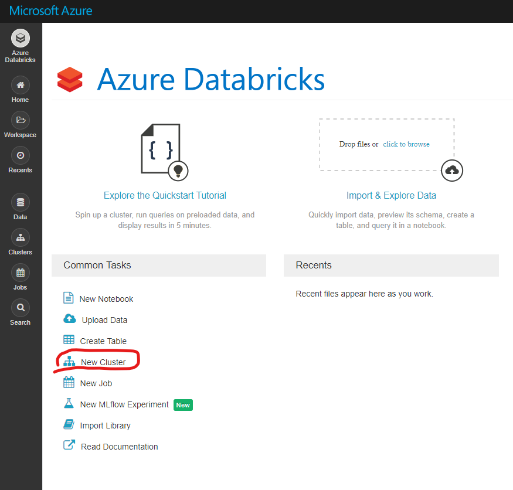
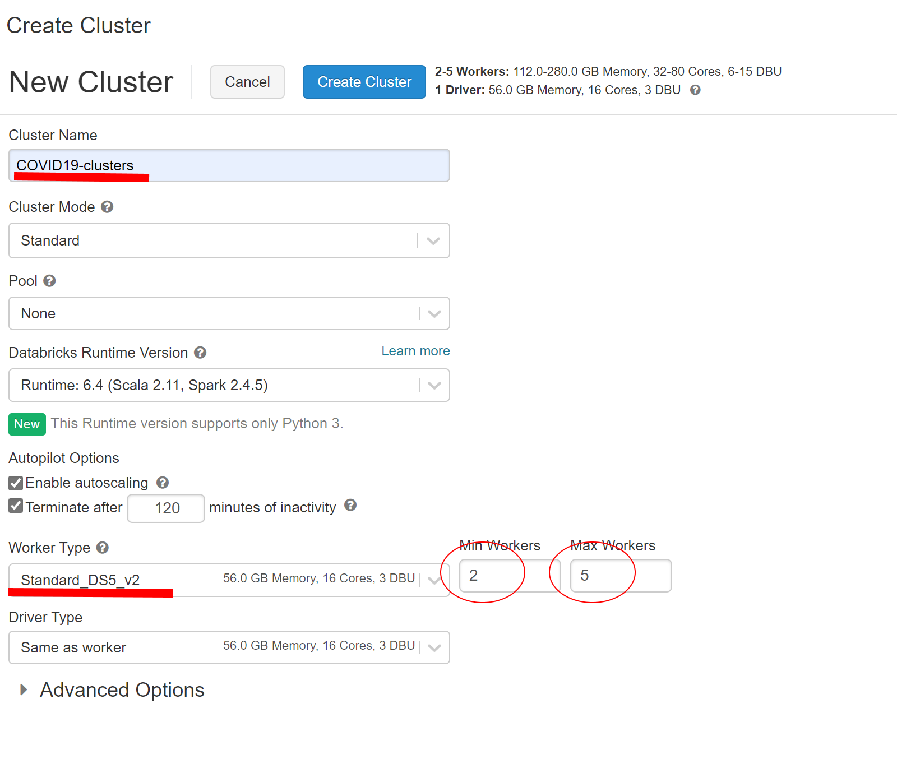
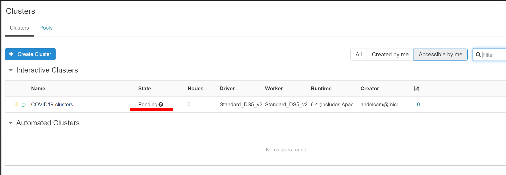

# Create Spark Cluster

## Pre-requisite task: [Create Azure Databricks](create-azure-databricks.md)

## Task: Create new Spark cluster

1. In the Databricks home page, click the **New Cluster** link under **Common Tasks**

    
    
1. Enter a cluster name, uncheck **Enable autoscaling**,  ensure **Terminate after** is checked. Set the following configurations:

* Worker Type: Standard_DS5_V2
* Mininum of workers: **2**. 
* Maximum of workers:  **5**

Click **Create Cluster**

    

1. Wait for the cluster to be created.

    

## Next task: [Create workspace](create-workspace.md)
