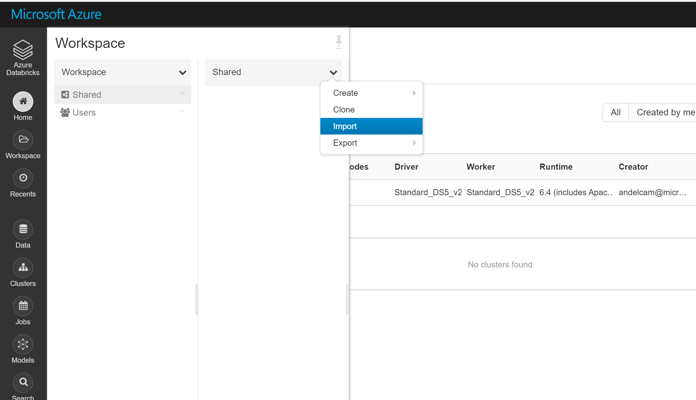
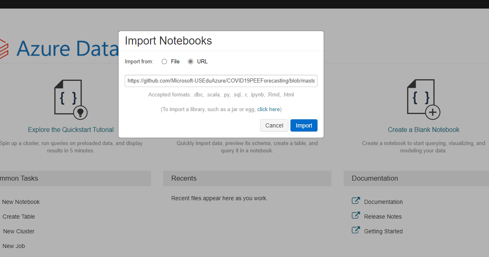
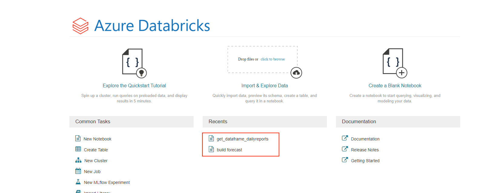

# Import Notebook

## Pre-requisite task: [Create Azure Databricks](create-azure-databricks.md)

## Task: Import Databricks Notebooks

1. In the Databricks navigation pane (on the left), click on the **Workspace** button

    

1. In the Workspace pane, click the *down* arrow to expand the menu, then navigate to *Shared*, clinck the *down* arrow and select **Import** 

 Select the URL option and copy and paste the URL below:

'https://github.com/Microsoft-USEduAzure/COVID19PEEForecasting/blob/master/deploy/azure-databricks/media/notebook/CovID19Forecasting.dbc'

1. Once the import is completed, you should see the following notebooks on your workspace

## Next task: [Configure notebook](configure-databricks-notebook.md)
