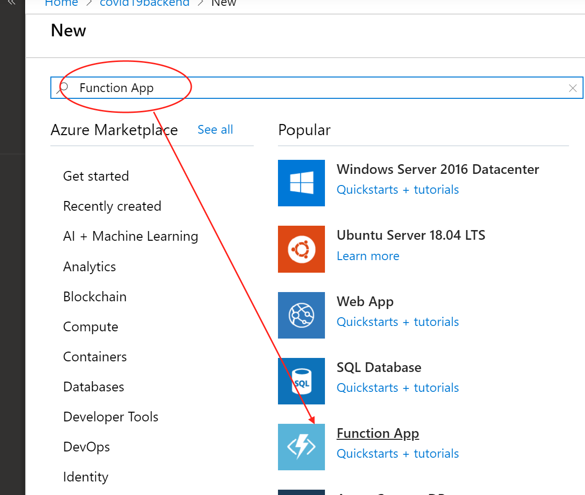
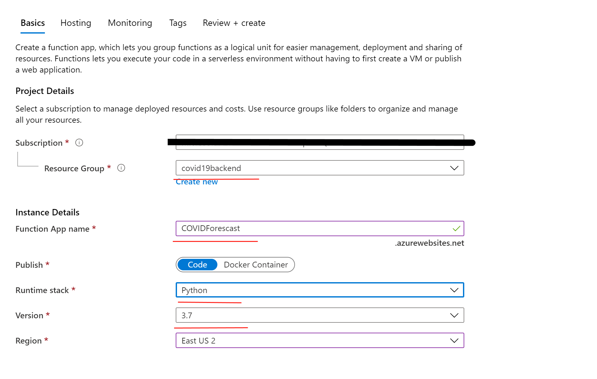
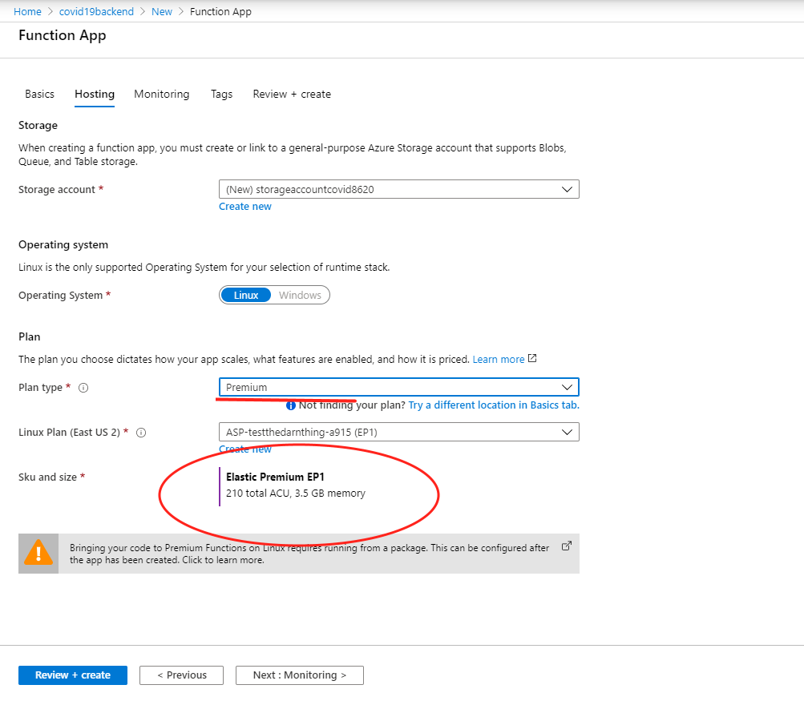
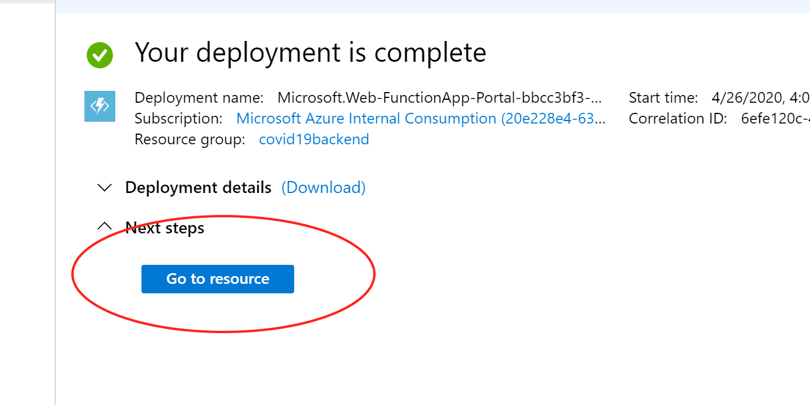

# Provision Azure Function

## Pre-requisite task: [Create Azure Data Factory V2](..\azure-data-factory-v2\provision-azure-data-factory-v2.md)

## Task: Provision an Azure Linux Based Azure Function

In this section will provision a Linux Based Azure function - this will hold the python code that performs statistical calculations for PPE forecasting

1. In Azure Portal, click **+Create a resource** link at top left of the page

1. In the Azure Marketplace search bar, type **Function App** and click on **Function APP** that appears in the drop down list

    

1. On the New Linked Service (Azure SQL Database) blade, enter the following details:
     - **Azure subscription**: *your subscription*
     - **Resource Group**: COVID19Backend
     - **Function App Name**: COVID19Forecasting+suffix
     - **Run Time Stack**: Python
     - **Version**: *3.7*
     - **Region**: Same as your resource group
     - **Authentication** Type: SQL Authentication
     - **User** Name: *your user name*
     - **Password**: *your password*
    
    

1. At the bottom of the screen, Click **Next -> Hosting**. Enter the following parameters:

     - **Plan Type**: *Premium*
     - **Sku & Size**: Elastic Premium

     At the bottom of the screen, Click **Create**.
    
    

1. Once the deployment is completed click on **Go to resource**

    

## Next task: [Deploy Function to App](deploy-function-app.md)