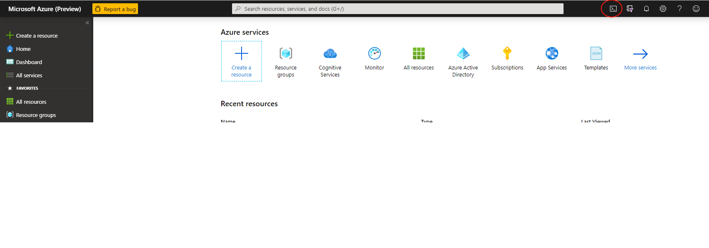
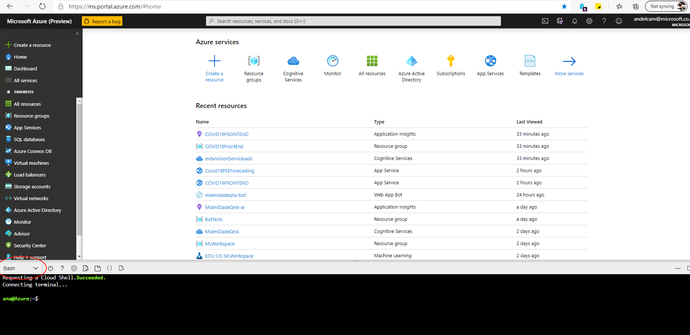

# Provision Azure Resource Group

## Task: Create resource group using Azure CLI

We will the following resource groups:

     * COVID19BackEnd
     * COVID19FrontEnd

>
Note: please select the same nearest data center for both groups


1. In Azure Portal, open Cloud Shell

    

1. Execute the following commands using Bash

    ```
    az group create -n COVID19BackEnd -l <ENTER_LOCATION_NAME>
    az group create -n COVID19FrontEnd -l <ENTER_LOCATION_NAME>   ```

        This is the reference list of location names

        |Display Name        | Name
        |------------------  |-------------
        |East Asia           | eastasia
        |Southeast Asia      | southeastasia
        |Central US          | centralus
        |East US             | eastus
        |East US 2           | eastus2
        |West US             | westus
        |North Central US    | northcentralus
        |South Central US    | southcentralus
        |North Europe        | northeurope
        |West Europe         | westeurope
        |Japan West          | japanwest
        |Japan East          | japaneast
        |Brazil South        | brazilsouth
        |Australia East      | australiaeast
        |Australia Southeast | australiasoutheast
        |South India         | southindia
        |Central India       | centralindia
        |West India          | westindia
        |Canada Central      | canadacentral
        |Canada East         | canadaeast
        |UK South            | uksouth
        |UK West             | ukwest
        |West Central US     | westcentralus
        |West US 2           | westus2
        |Korea Central       | koreacentral
        |Korea South         | koreasouth
        |France Central      | francecentral
        |France South        | francesouth
        |Australia Central   | australiacentral
        |Australia Central 2 | australiacentral2
        |UAE Central         | uaecentral
        |UAE North           | uaenorth
        |South Africa North  | southafricanorth
        |South Africa West   | southafricawest

 

## Next task: [Create SQL Server Database](../azure-sql/create-azure-sql.md)  
