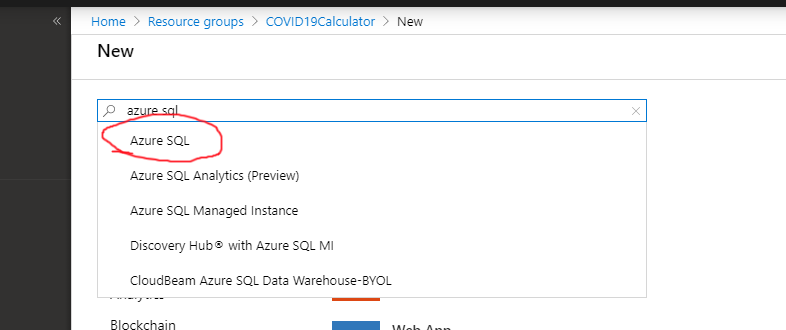
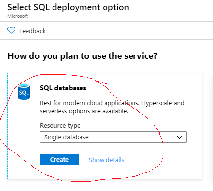
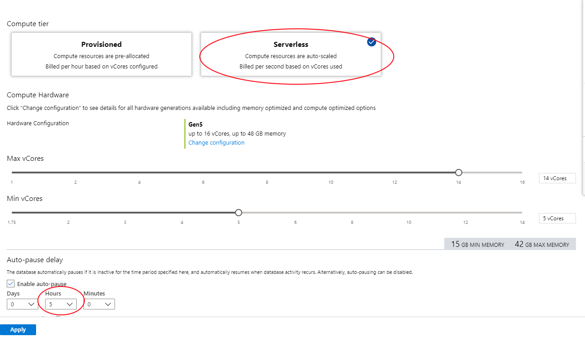
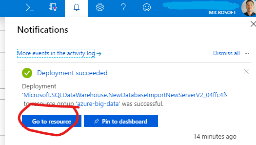
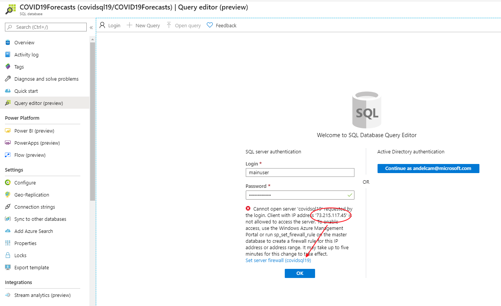
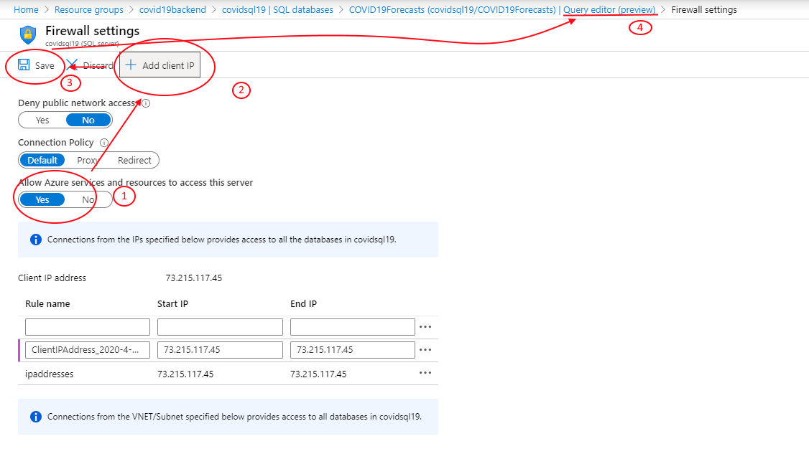
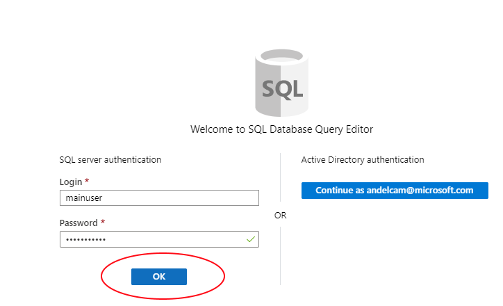

# Provision Serverless SQL Database

## Pre-requisite task: [Create Azure Resource Group](../azure-resource-group/create-azure-resource-group.md)

## Task: Provision Azure Serverless Database & SQL Server
### This database will hold COVID18 Forecast records
1. In the [Azure Portal](https://portal.azure.com), click **+Create a resource** link at top left of the page.

1. In the Azure Marketplace search bar, type **azure SQL** and click on **Azure SQL)** that appears in the drop down list

    

1. Click the **Create** button.

1. Select single database option

    

1. Enter the following paramenters:
    <br> - **Name**: COVID19ForeCasts
    <br> - **Subscription**: *Select your subscription*
    <br> - **Resource Group**: COVID19Backend
    <br> - **Select source**: *Select Blank database*
    <br> - **Server**:  *Create a new server*
    <br> - **Server Name**: covid19+*suffix*
    <br> - **Server admin login**: mainuser
    <br> - **Password**: #covid2019#
   
   > **NOTE: Make sure the Location of your SQL Server is the same as the location of your resource group**


1. Click the **Configure Database** and select the following configuration:
    
    * Serverless
    * Max VCores: 16
    * Min VCores: 5
    * Pause after: 5 hours
    
    
    
1. Check the **Notifications** icon in the upper right and wait until you see **Deployment succeeded** then click the **Go to resource** button.

    

## Task: Configure Server Firewall, Create Database Tables & Stored Procedures

1. Navigate to the **Query editor** blade and login using your server credentials, you will get an error message, select the IP Address on the error message and copy it, then click on the link **set server firewall**

    

1. At the firewall configuration settings follow these steps:
	1. Allow Azure services and resources to access this server to Yes
	1. Click in Add Client IP button to allow your PC to access the database
	1. Click the save button
	1. Click the Query Editor breadcrumb at the top of the screen to go back to the Query Editor
	
    

1. Back at the Query Editor, click on the OK button
          

1.	On the new query window, create required tables and stored procedures. Copy and paste the SQL Script below and then click run.

```sql
SET ANSI_NULLS ON
GO
SET QUOTED_IDENTIFIER ON
GO
CREATE TABLE [dbo].[CovId19](
	[fdates] [date] NOT NULL,
	[forecast_vals] [float] NOT NULL,
	[CountryRegion] [varchar](100) NOT NULL,
	[ProvinceState] [varchar](100) NOT NULL,
	[model] [varchar](20) NOT NULL,
	[obs_pred_r2_G] [float] NULL,
	[newcases] [int] NULL,
 CONSTRAINT [PK_CovId19] PRIMARY KEY CLUSTERED 
(
	[fdates] ASC,
	[forecast_vals] ASC,
	[CountryRegion] ASC,
	[ProvinceState] ASC,
	[model] ASC
)WITH (STATISTICS_NORECOMPUTE = OFF, IGNORE_DUP_KEY = OFF) ON [PRIMARY]
) ON [PRIMARY]
GO

SET ANSI_NULLS ON
GO
SET QUOTED_IDENTIFIER ON
GO
CREATE TABLE [dbo].[CovId19Staging](
	[fdates] [nvarchar](max) NULL,
	[forecast_vals] [float] NULL,
	[CountryRegion] [nvarchar](max) NULL,
	[ProvinceState] [nvarchar](max) NULL,
	[model] [nvarchar](max) NULL,
	[obs_pred_r2_G] [float] NULL
) ON [PRIMARY] TEXTIMAGE_ON [PRIMARY]
GO

SET ANSI_NULLS ON
GO
SET QUOTED_IDENTIFIER ON
GO
CREATE PROCEDURE [dbo].[DeleteStagingTable]

AS
BEGIN
IF OBJECT_ID('dbo.CovId19Staging', 'U') IS NOT NULL 
  DROP TABLE dbo.CovId19Staging; 
   
END
GO

SET ANSI_NULLS ON
GO
SET QUOTED_IDENTIFIER ON
GO
CREATE PROCEDURE [dbo].[ProcessNewRecords]

AS
BEGIN
    truncate table [dbo].[CovId19]


INSERT INTO [dbo].[CovId19]
           ([fdates]
           ,[forecast_vals]
           ,[CountryRegion]
           ,[ProvinceState]
           ,[model]
           ,[obs_pred_r2_G])
    select [fdates]
           ,[forecast_vals]
           ,[CountryRegion]
           ,[ProvinceState]
           ,[model]
           ,[obs_pred_r2_G] from [dbo].[CovId19Staging]


Update CovID19 
set newcases =  forecast_vals - isnull((Select forecast_vals from CovId19 c where CovId19.ProvinceState = c.[ProvinceState] and CovId19.CountryRegion = c.countryregion and c.fdates = DATEADD(DAY, -1, CovId19.fdates) and CovId19.model = c.model),0) 


Declare @deleteDate  date
select @deleteDate = min(fdates) from covid19 
select @deleteDate

delete from CovID19 where fdates = @deleteDate

END
GO

```

## Next task: [Create Azure Data Factory V2](../azure-data-factory-v2/provision-azure-data-factory-v2.md)
