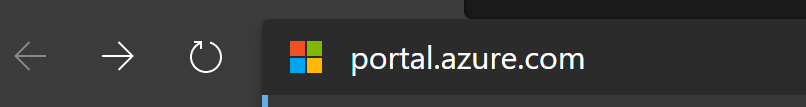
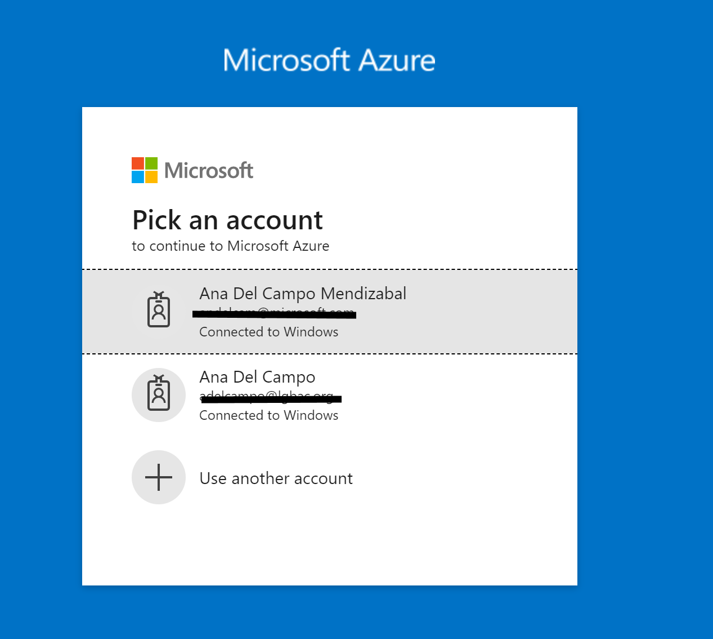
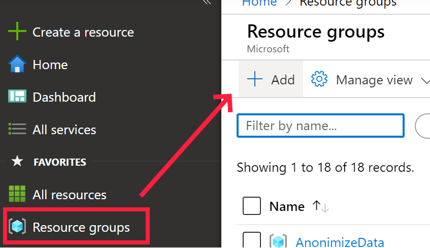

# COVID19 PEE Forecasting Calculator Deploy to Azure

## Provision Resources

### [Task 1: Create Azure Resource Group](deploy/azure-resource-group/create-azure-resource-group.md)

### [Task 2: Create Azure SQL Database](azure-ad-service-principal/create-service-principal.md)

### [Task 3: Create Azure Databricks)](azure-sql-datawarehouse/provision-azure-sql-data-warehouse.md)

### [Task 4: Create Azure Data Factory V2](azure-data-factory-v2/provision-azure-data-factory-v2.md)

## Prepare your Azure Subcription

IMPORTANT: You need to create 2 resource groups for this project:

* COVID19Forecast - all backend resourses will be deployed to this resource group.
* COVID19FrontEnt - ASP .Net Front end will be deployed to this resource group.

1.- Open the browser and navigate to https://portal.azure.com

2.- Log into your Azure Account

3.- Once you have successfully logged on, locate the Favourites menu on the left-hand side panel and click the Resource groups item to open the Resource groups blade.

4.- On the Resource groups blade, click the + Add button to create a new resource group.

5.- On the Create a resource group blade, select your subscription in Subscription drop down list.

6.- In the Resource group text box enter “COVID190Forecast”

IMPORTANT: The name of the resource group chosen is not relevant to the successful completion of the labs. If you choose to use a different name, then please proceed with the rest of the lab using your unique name for the resource group.

In the Region drop down list, select one of the regions from the list below.

IMPORTANT: The ARM template you will use to deploy the lab components uses the Resource Group region as the default region for all services.

Deploy Backend:

7. - Repeat steps 4 and 5 to create the COVID19FrontEnd resource group.

Deploy Front End:

