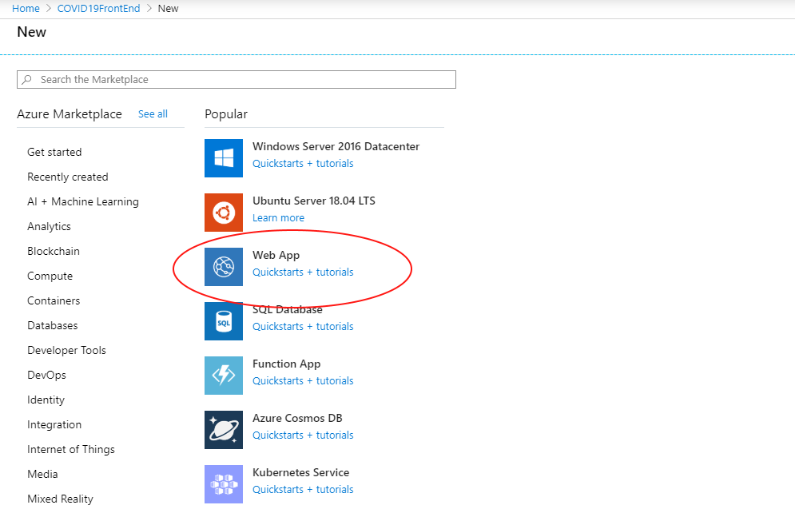
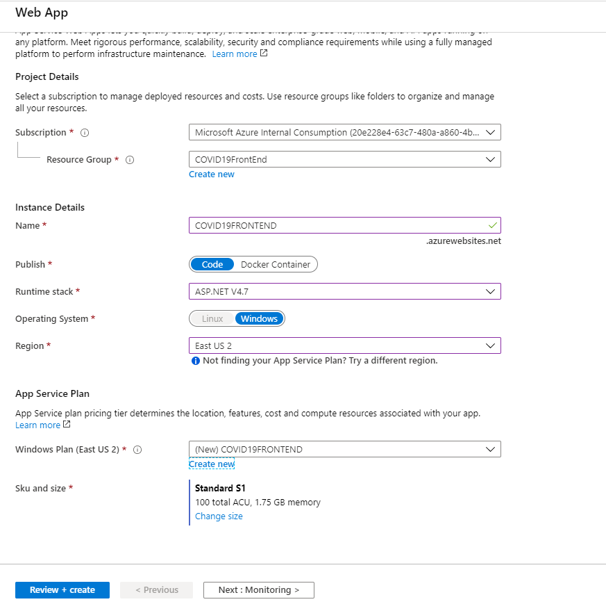
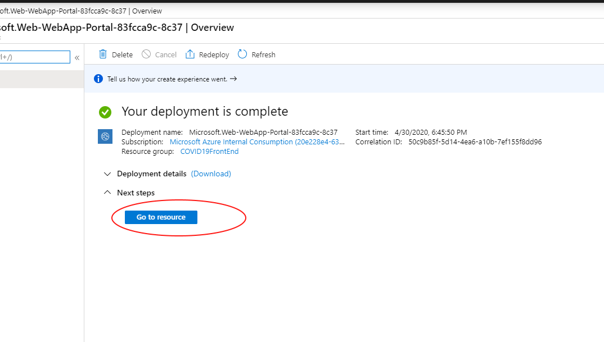
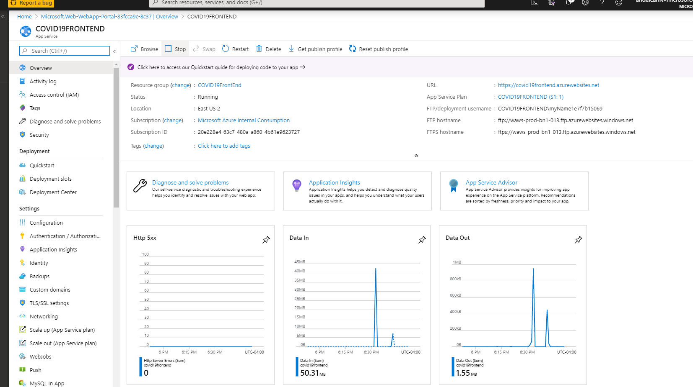

# Provision Front End App

## Pre-requisite task: [Deploy Azure Function](..\azure-function\deploy-function-app.md)

## Task: Provision an App Service

In this section will provision a Windows Based Web App - This is the front end of the application

1. In Azure Portal, click **+Create a resource** link at top left of the page

1. In the Azure Marketplace search bar, type **Function App** and click on **Function APP** that appears in the drop down list

    

1. On the New Linked Service (Azure SQL Database) blade, enter the following details:
     - **Azure subscription**: *your subscription*
     - **Resource Group**: COVID19FrontEnd
     - **Function App Name**: COVID19FrontEnd+suffix
     - **Run Time Stack**: ASP.NET V4.7
     - **App Service Plan**: (click new), enter a name
   
    Leave default the rest of the fields as default.
    
    

     At the bottom of the screen, Click **Create**.

1. Once the deployment is completed click on **Go to resource**

    

    You should be able to see your new Web App

    

## Next task: [Deploy Website](deploy-website.md)
