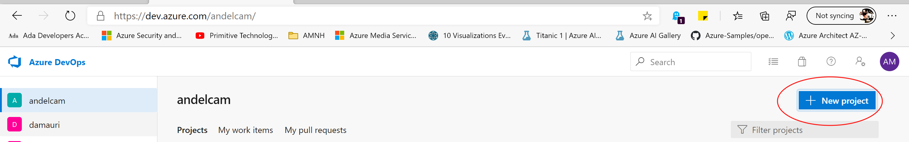

# Deploy Website

## Pre-requisite task: [Create  App](create-function-app.md)

## Task: Deploy Front End Website

In this section will deploy front end website

### Task: Deploy libraries using Azure DevOps

1. Navigate back to  <a href="https://dev.azure.com/">Azure DevOps Portal</a> and click on the **Sign in to Azure DevOps** and enter your credentials.

1. Create a new project

    

1. Enter the following information:

     - **Project name**: COVIDFrontEnd
     - **Visibility**: Your choice

   

    Click on **Create**

1. On the left blade navigate to **Repos** and click on **Files**:

   

1. Click on the **Import Repository** option:

   

1. Copy and paste the following link to the **Clone URL** text box

   https://andelcam@dev.azure.com/andelcam/CovID19CalculatorNet/_git/CovID19CalculatorNet

   

   Click on the **Import** button

1. Once the repository is imported, you should see the files uploaded

   

1. Navigate to **Pipelines**, click to **Create Pipeline**

   

1. Select the COVIDFrontEnd repository

   
   

1. The deployment YAML file detailing the initial pipeline workload will be displayed. Follow these steps:

      - **Scroll** all the way to the end of the file
      - Press Enter to create a new line
      - Click on **Show Assistant** button located at the top right corner

   

1. Type **Azure App** on the search box and select the **Azure App Service deploy** option

   

1. Select your subscription from the dropdown box and click the  **Authorize** button, you won't be able to continue without authorizing the deployment to this subscription.

   

1. Next enter the following information:
      - **App Service type**: Web App on Windows
      - **App Service name**: COVID19FrontEnd (or the name you gave your Application)
      - **Package or Folder**:  $(Build.ArtifactStagingDirectory)/**/*.zip

   > Note: Please make sure to change the package or folder value, otherwise your deployment will fail.

   Click the **Add** button

   

1. You will see changes to the YAML file with your App Service information, click on the **Save and Run** button to deploy your application

   

1. Once the pipeline is completed you should see the pipeline progress:

   

### Task: Troubleshoot deployment

On rare occassions you may need to authorize subscription access at deployment type. If you see the following message during your deployment, click on the **Permissions needed** link to grant access to your subscription

Your deployment should be able to continue after authorization

### Task: Update Website configuration

In this task we will configure the connection to the SQL server and provide the Front end with the link to the Azure function

1. Navigate back to **Azure Portal** open **COVID19FrontEnd**.Navigate to the left blade click on **Configuration**

 

 1. At the configuration screen, click on the **New Applciation Setting** button

 

 1. Enter the following information
    
       - **name**: sqlConnection
       - **value**: Persist Security Info=False;Data Source = **yourServerName**.database.windows.net,1433; Initial Catalog = COVID19Forecasts; User Id = **username**;Password=**password**

      click on the **Ok** button

 

 1. At the configuration screen, click on the **New Applciation Setting** button again

    Enter the following information
    
       - **name**: AzureFunctionURL
       - **value**: https://**YOURFUNCTIONAPPNAME**.azurewebsites.net/api/calculatePoisson

      click on the **Ok** button

    

 1. Navigate to the left side blade and click on the overview button

1. Open the website by clicking on the URL Link

1. You should be able to see the website:

## What is next?

You have completed the deployment of this solution, you can now proceed to change the code to customize the look and feel as well as to enhance/change functionality as you see fit.